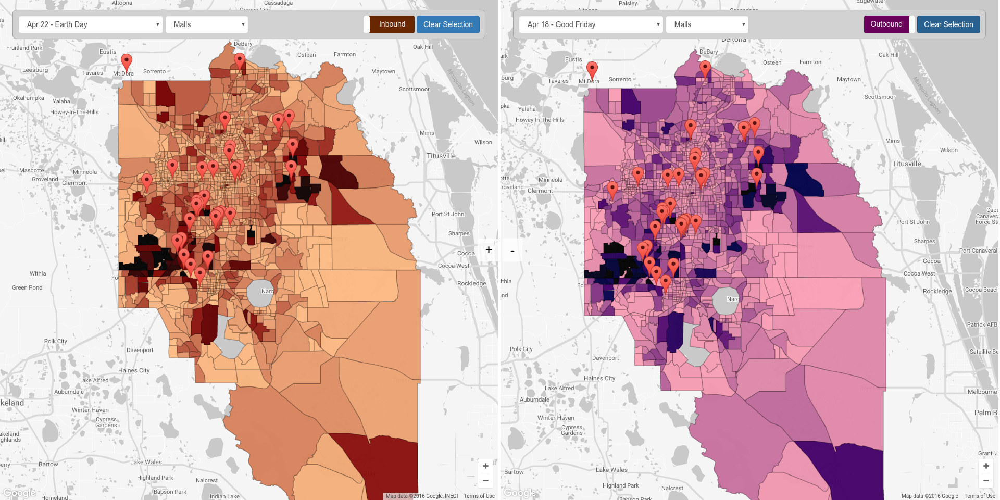
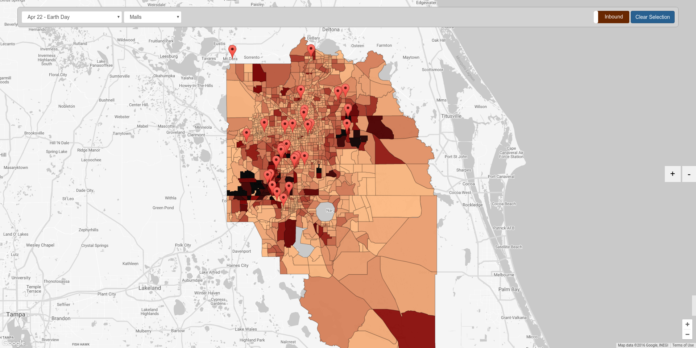
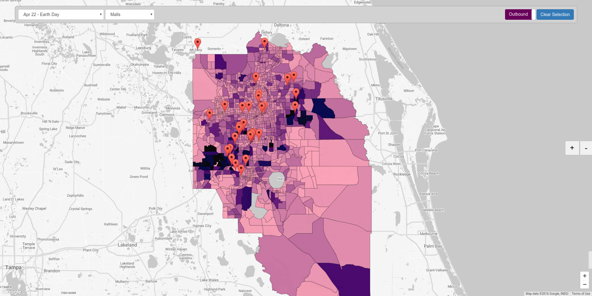
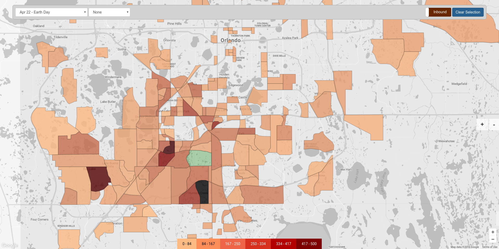
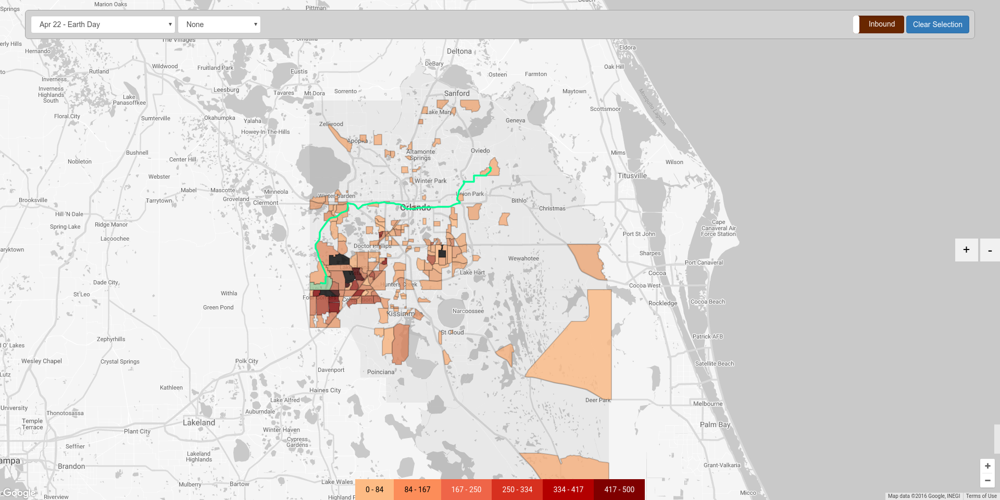
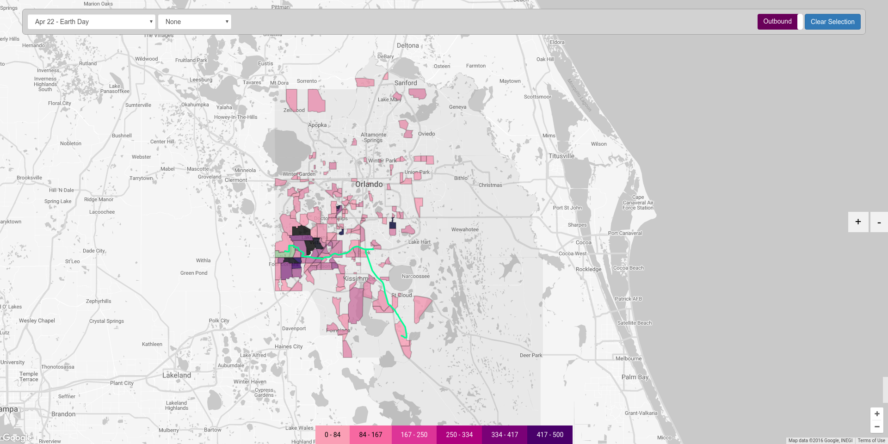
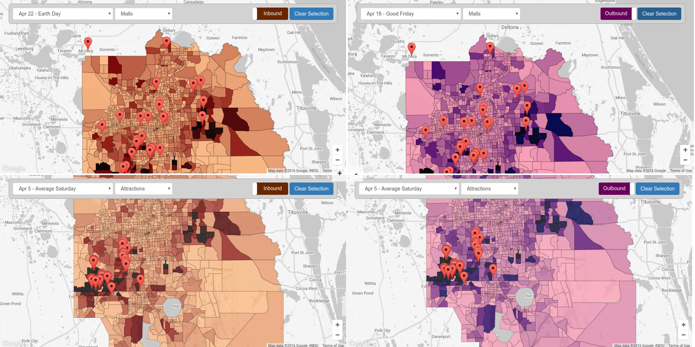

# TRB Data Contest - Orlando Travel Data

### [Hosted Project](http://cs424-project3.s3-website-us-east-1.amazonaws.com/)

### [Write-up](https://drive.google.com/open?id=0B6x3HIilWkMASVRBUkx2d3NRYmc)

### Students
* [Federico Ruiz](https://github.com/fedex995)
* [Sergio Barajas](https://github.com/sbaraj5)
* [Nicolas Burroni](https://github.com/nburroni)

### The Data
For this project we visualize travel patterns in Orlando, comparing travel density between different holidays during the month of April, and showing points of interest in the area to relate to travel patterns.
### Dataset Type
The data represents a list enumerating the trips that took place for each day in the month of April of 2014. Each trip lists the origin and destination zones, the time of the day, and the type of trip it was.
#### Motivation & Audience
The audience is anyone who is interested in finding out travel patterns in Orlando, either to plan a trip, or to try and reduce traffic in congested areas during peak times. We find this is helpful to reduce the amount of traffic during holidays by planning ahead and finding out which are the most attended zones.

We wanted to create a visualization that would allow users to compare between different holidays or average days of the month, overlaying points of interest such as attractions or churches. We intend to answer questions such as: 
* "Should I expect more people to travel to this particular area where a church is located during Easter?"
* "There is a long weekend coming up. Does Disney World tend to get too crowded on long weekends?"
* "Is it more convenient to go to a mall during the week or during the weekend?".

#### Datasets
We used three different datasets for this project.  
##### Orlando Metropolitan Area Travel Data
This dataset provided all of the trips for each day of the month of April 2014, listing the origin and destination zones, the time of the day, and the type of trip it was. This was the main, and largest, dataset of this visualization.

##### Supplemental Holiday Data
This dataset provided information about holidays in the US during the month of April 2014.

##### Supplemental Points of Interest Data
We used Google Maps API to perform search based on terms such as "attractions", "catholic churches", "jewish temples" and "malls", which provided us with the results shown with markers.

#### Interesting Results Found
* The zones where the Disney parks are located have the most amount of inbound trips
* High-level travel patterns look very similar between days; zones tend to maintain the amount of inbound trips they have
* Zones containing malls usually see an increase in inbound trips during weekends

### The Visualization


#### Detailed Description
The visualization starts showing colored zones. The color intensity represents the total amount of inbound or outbound trips corresponding to each zone. The user can switch between inbound or outbound view by clicking on the toggle present at the top right. The user can click on a specific zone, which will cause it to be selected and show only the zones which have trips to (inbound) or from (outbound) that zone. Once again, the color intensity represents the amount of trips that correspond. A legend will appear on the bottom to provide a more detailed reference on the color scale. When a zone is selected, if the user hovers over another colored zone, the recommended route by Google Maps will be drawn on the map. The user can then click on the hovered zone to keep the route drawn. If clicked again, the route will disappear. To go back to the initial state, the user may click again on the selected zone, or click on the button with the label "Clear Selection". The user can select an overlay with markers showing different points of interest, such as attractions, churches, temples or malls. Clicking on a marker will show an info window with the name of that point of interest. The user can select a different holiday or average day. More map frames can be added or removed for comparison by clicking on the plus or minus signs which are placed at the right of the screen at first, and placed at the center when more than one frame is present. Each frame acts independently of each other, to provide freedom to the user to be able to choose the specific data they want to compare.

#### [Click to watch video](https://youtu.be/8gy5Otlwdjo)
[](https://youtu.be/8gy5Otlwdjo)

This map can provide a high-level overview of inbound or outbound density per zone



The user can zoom in to see the zones with more detail


The user can click on a zone to get information about the amount of trips from or to other zones



The user can add to up to four maps to compare data


#### Visualization Tasks
##### Analyze
Our visualization achieves the task of analyzing the data. More in particular, the user can consume the data shown in the visualizations. This data already existed, but it was processed so the user can discover, present or enjoy. It may be in his/her interest to analyze the data in order to know more about a yet not understood aspect of travel patterns within Orlando. 
##### Discover
Users can discover new information. For example, if wanting to prove a theory which states that zones with malls usually get more crowded during weekends, the tools provided by the visualization would help to discover that that theory is true.
##### Present
A user may want to present to others something already known. For example, the user may present to others how during an average weekday people commute from the suburbs to the city. It’s important to say that in this case, the knowledge communicated is already known by the recipient. Interaction is also important while presenting the data. The user may hover over a zone in order to show the route Google Maps recommends, which most likely will be the most used.
##### Enjoy
Users that don’t form part of the target audience can enjoy the visualization. Many people, although they don’t have any discovering or presenting purpose while using the vis, can use it simply to learn about travel patterns within Orlando, or just play around with the zones and routes. 
##### Lookup
This task may be one of the most influential in our visualization. If a user already knows which zone he/she wants to look into, they just have to remember where it is located geographically, and will get all the travel information from there.
##### Browse
In other cases, the user doesn’t know exactly what he/she wants. Keeping up with the last example, the user may use the holiday filter in order to see in the map the selected holiday, and they may also select an overlay showing points of interest to help browse. 
##### Compare
By adding more map frames and selecting different holidays and/or overlays, the user can compare between them. By having multiple frames, the visualizations can be compared side by side to clearly see the differences.
##### Summarize
These visualizations include highly dense data-sets, so we had to make sure that we didn’t go too specific in the data we were showing, in order to grant the user the possibility to give an overview of the situation. This is why we made averages of the data daily, so the user can get general insight for every day we present.
#### Interactive Techniques
##### Select Elements
The user may select zones or different points of interest to visualize those selected in specific. Hovering over a zone after having selecting another zone reveals the recommended route between the two.
##### Navigate
The user can zoom and pan the map visualization to provide greater detail. The user is unconstrained as in they can zoom and pan freely on the map.


### How To Run
#### 1. Download the project source code
Either clone the project, or download it manually and extract it.

#### 2. Open a Terminal and run your favorite server
We developed this project using python's server functionality, so for best results we recommend using the same.
```bash
$ cd /path/to/source-code
$ python -m SimpleHTTPServer <port>
```

#### 3. Fire up Chrome (yes, please use Chrome)
We kindly ask for you to use Chrome, which is what we used while developing, and where we got the best results. Open it, and navigate to `http://localhost:<port>/`

#### 4. You're all set!
You can now explore the visualization dashboard.

### Who Did What
* [Federico Ruiz](https://github.com/fedex995)
  * Routes between zones
  * Google Maps API Directions request handling

* [Sergio Barajas](https://github.com/sbaraj5)
  * Zone polygon rendering
  * Zone click and different color scale functionality

* [Nicolas Burroni](https://github.com/nburroni)
  * Data filtering, mapping and reducing
  * Points of interest overlay
  * Multi-map visualization
